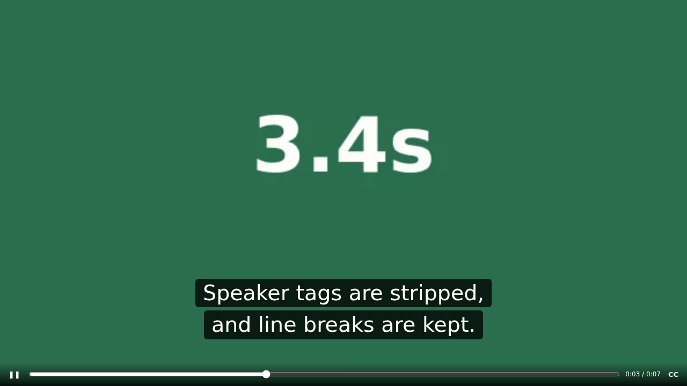

# PiP Captions

Picture-in-Picture that keeps the subtitles.



## Why other PiP extensions lose captions

Classic PiP (`video.requestPictureInPicture()`) shows only the video's
frames. Most sites (YouTube, Netflix, Prime, …) draw subtitles as ordinary
HTML on top of the video, so those never reach the PiP window. Chrome
doesn't even draw native `<track>` captions there.

## How this one works

It uses the [Document Picture-in-Picture API][dpip] (Chrome and Edge 116+),
which opens an always-on-top window that can hold any HTML:

1. Moves the page's `<video>` element into the PiP window. It keeps playing,
   and DRM video works because the element is moved, not copied.
2. Reads the current caption from the page:
   - **YouTube / Netflix**: watches the site's caption DOM with a
     `MutationObserver`. See `src/content/sources.js`.
   - **Any site with `<track>` subtitles**: listens to `cuechange` on the
     active text track.
3. Draws the caption, sized to the window, plus a small control bar (play/pause,
   seek, CC toggle).
4. Puts the video back where it was when the window closes.

[dpip]: https://developer.chrome.com/docs/web-platform/document-picture-in-picture

## Install (unpacked)

1. Go to `chrome://extensions` and turn on **Developer mode**.
2. Click **Load unpacked** and pick this folder.

## Use

- Hover a video and click **⧉ PiP + CC**, or
- press **Alt+Shift+P** on the page.

Do the same again to close it. Inside the PiP window: **Space** / **K** play or
pause, **←/→** seek 5s, **C** toggles captions.

Chrome only opens the PiP window from a click or key press *inside the page*,
so the toolbar icon may be refused. You'll then see a hint to use the
button or shortcut.

## Try it locally

`demo/index.html` generates a video in the browser and adds a WebVTT subtitle
track. Document PiP needs a secure context, so serve it from `localhost`:

```sh
npx serve demo   # then open the printed localhost URL
```

## Tests

```sh
npm install
npm test          # headless Chromium with the extension loaded
HEADED=1 npm test # watch it run
```

The end-to-end test opens PiP on the WebVTT demo and on a mock YouTube page.
It checks that captions show up in the PiP window, that the video keeps
playing, and that the video is restored when the window closes.

## Adding a site

Add an entry to `PipCaptions.sources` in `src/content/sources.js`:

```js
PipCaptions.sources.push({
  name: 'example',
  matches: (loc) => loc.hostname.endsWith('example.com'),
  attach(video, emit) {
    const root = video.closest('.player');
    if (!root) return null; // let the next source try
    const read = () => PipCaptions.textLines([...root.querySelectorAll('.caption-line')]);
    return PipCaptions.observeDom(root, read, emit); // returns detach()
  },
});
```

Site sources are listed before the generic `native` one, so they win.

## Limitations

- **Chromium only.** Firefox and Safari don't have Document PiP yet. There the
  extension falls back to classic PiP without captions. (Firefox's built-in
  PiP already shows subtitles on many sites.)
- **Site selectors break.** YouTube is covered by the tests (with mock
  markup); Netflix is untested. Both depend on the site's class names.
- **Some players may react badly** to their `<video>` leaving the page. Test
  a site before relying on it.
- **Not yet in the extension:** a canvas + `captureStream()` fallback for
  browsers without Document PiP, caption style settings, and more sites
  (Prime Video, Disney+, Coursera, …).
